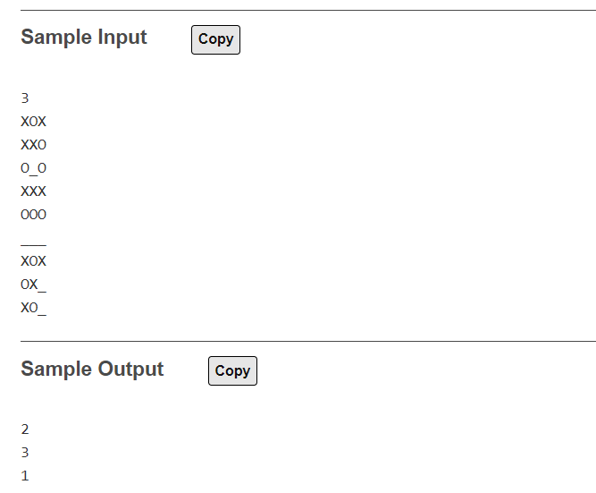

# CodeChef Copy

CodeChef Copy is a web browser extension for [codechef.com](https://www.codechef.com) to copy sample test cases from the contest problems page to the clipboard with a single click. It works on Firefox, Chrome, Brave, Edge etc.

## Getting Started

 * If you are using Firefox, [click here](https://addons.mozilla.org/en-US/firefox/addon/codechef-copy/) to add the extension from [addons.mozilla.org](https://addons.mozilla.org).

 * To add in chromium-based browsers, first download this repository as zip and extract the files to a folder. Then, turn on the `Developer mode` and select `Load Unpacked` in the extensions manager to locate the folder.

**Note :** Open the problems in new tab (Ctrl + Click) to make sure it works every time. If it still doesn't work, refresh the page.
